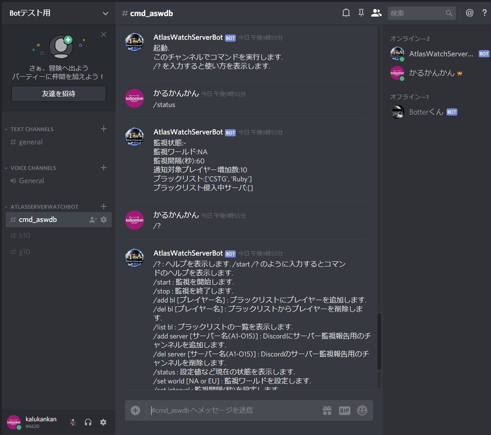
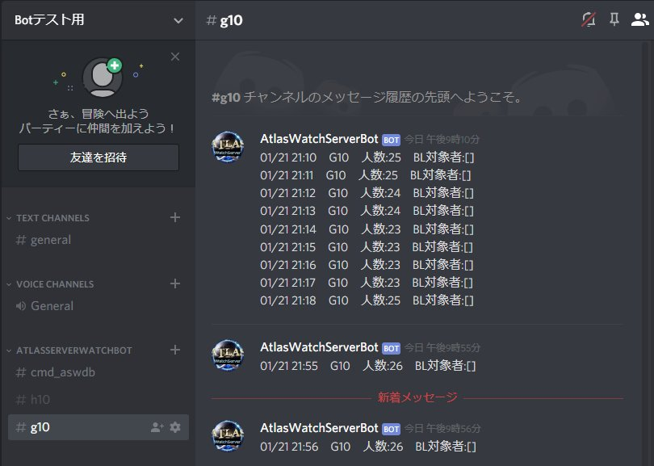

# atras-watch-server-discord-bot
Atlasの各サーバーのプレイヤーを監視し、サーバー人口が急激に増加したりブラックリストに載っているプレイヤーがサーバーに侵入した場合に@everyoneメッセージを送信するBotです。  
It monitors the players of each server of Atlas and sends a @everyone message when the server population increases suddenly or a blacklisted player breaks into the server.  

Appreciation!  
Reznok's Atlas Tracker  
https://atlas.reznok.com/

## イメージ

## 機能概要
- BotをDiscordサーバーに追加してBotを起動すると #cmd_aswdbチャンネルを作成します
- #cmd_aswdbチャンネルにてコマンドを打ち込むことでBotを操作します
- 監視サーバーを追加するとサーバー名(#a1,#h15等)のチャンネルを作成します
- 監視を開始するとサーバー名のチャンネルに監視期間毎にメッセージを送信します

## 開発環境
- PyCharm 2018.3.3 (Community Edition)
- Python 3.6 
  (Python 3.7 は discord.py 0.16.12 が対応していないため)

## 実行方法
* 下記参考し自分のBot作成
    - https://qiita.com/1ntegrale9/items/9d570ef8175cf178468f
* settings.ini の bot_token に作成したBotのトークンを貼り付ける
* あとはおもむろに実行してBotがメッセージ送信できたらOK
